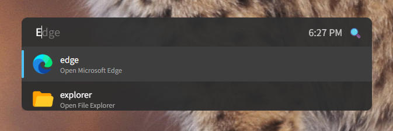

# Meow Twist — A smart command launcher for when you’re too busy to click.

A minimal Electron-based smart launcher featuring command suggestions, ghost autocomplete, and Google search fallback.

This app was built to address environments where installing traditional applications, like Flow Launcher, Raycast, is restricted, but running Node.js scripts is permitted—such as in certain locked-down work PCs.



## Features

- 🔍 **Command Suggestions** – Dynamic dropdown based on input  
- 👻 **Ghost Suggestion** – Light prediction overlay for quick completion  
- 🕒 **Live Clock** – Real-time clock displayed alongside input  
- ⌨️ **Keyboard Navigation** – Arrow keys to select, Tab to autocomplete  
- 🌐 **Google Fallback** – Falls back to Google search if no command matches  

## Getting Started

### 1. Install Dependencies

```bash
npm install
```

### 2. Run Electron App

```bash
npm start
```
Or just double click `launch.vbs`.

## Usage

Start by `Ctrl+Space` and type to:

- Get instant suggestions from your predefined commands
- Hit `Tab` to autocomplete the command
- Press `Enter` to launch the selected command or search Google
- Use `ArrowUp` / `ArrowDown` to cycle suggestions

## Customization

### 🔧 Add Your Own Commands

You can supply commands from the main process by editing `plugins.json`.

Example command object:

```json
"targetCommand": {
  "exec": "Command here",
  "description": "Description here",
  "icon": "Icon here"
},
"targetUrl": {
  "url": "Url here with inputted {{query}}",
  "description": "Description here",
  "icon": "Icon here"
},
```

### 🎨 Theme or Style

Edit `assets/style.css` to customize colors, shadows, font size, etc.

## Keyboard Shortcuts

- `Ctrl+Space` — Trigger search / launch  
- `Escape` — Close window  
- `ArrowUp / ArrowDown` — Navigate suggestions  
- `Tab` — Autocomplete with ghost suggestion  

---

Built with ❤️ using [Electron](https://electronjs.org/)
